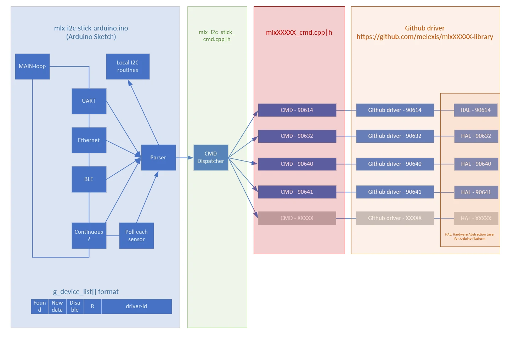

# Melexis I2C Stick -- Hardware & Software.

## Hardware

Our goto board is this MCU boards:

- <https://www.adafruit.com/product/5056> (Adafruit Trinkey QT2040)

But it is known to work as well on those boards:

- <https://www.adafruit.com/product/4500> (Adafruit nrf52 CLUE)
- <https://www.adafruit.com/product/4900> (Adafruit QT Py RP2040)
- <https://www.pjrc.com/teensy/> (Teensy)

This sketch requires a board with a fair amount of memory, as we support
multiple slaves as well the FIR array sensors.

## Software

### Block diagram.

### Other resources

Besides this Arduino sketch, you also can have a look at our non-contact temperature drivers:

- <https://github.com/melexis/mlx90614-library>
- <https://github.com/melexis/mlx90632-library>
- <https://github.com/melexis/mlx90640-library>
- <https://github.com/melexis/mlx90641-library>

Those are our released drivers.  
They require you to implement a couple of I2C routines specific for the MCU you choose.

For Arduino, you will find here an example on how to implement those I2C routines.

It is recommended to start your project from the above linked github drivers to build your own
software, and use this Arduino project to get inspired. Especially the for the I2C routines and the functions within the sensor specific 'cmd' routines in the files `mlx<12345>_cmd.cpp/h`.
