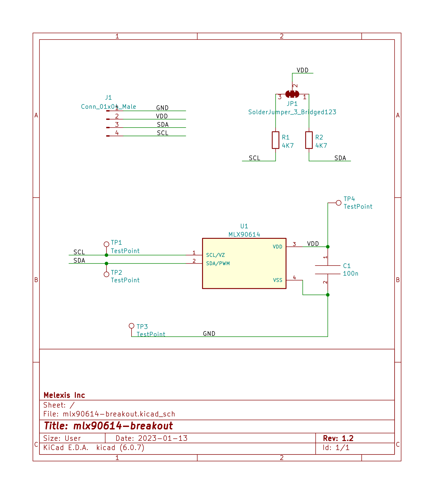
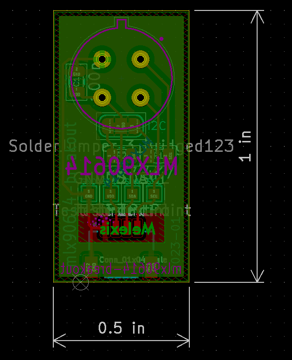
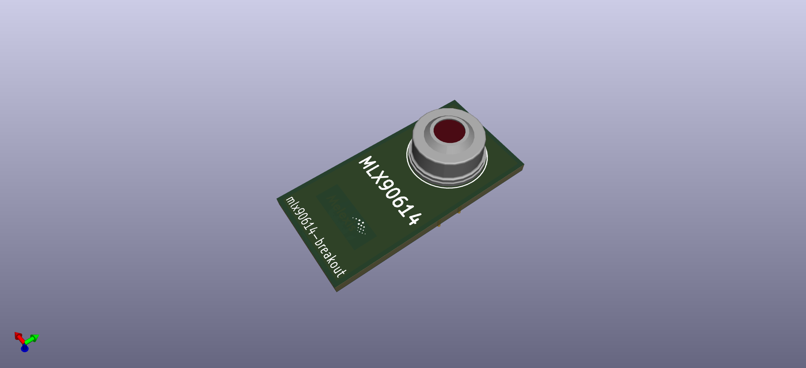
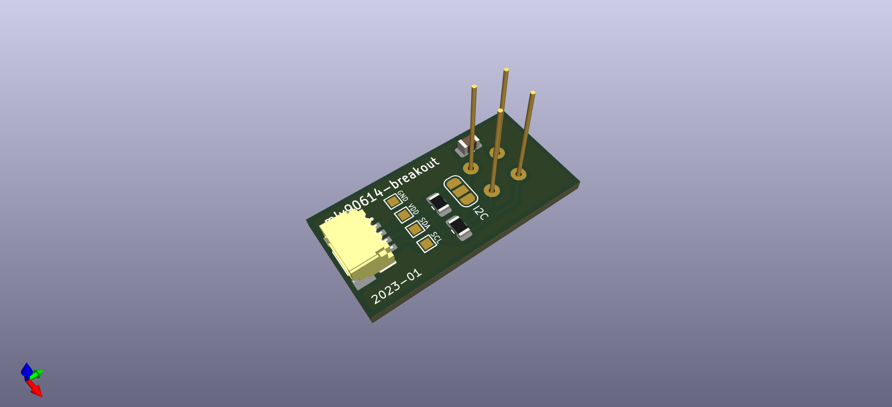

# MLX90614 Breakout

## The sensor

Breakout PBC for MLX90614:  
https://melexis.com/mlx90614

Order codes for the sensor:

### Standard accuracy:  

- MLX90614ESF-BAA-000-SP: 90 Deg FoV
- MLX90614ESF-BCC-000-SP: 35 Deg FoV
- MLX90614ESF-BCF-000-SP: 10 Deg FoV
- MLX90614ESF-BCI-000-SP:  5 Deg FoV

### Medical Accuracy:

- MLX90614ESF-DCC-000-SP: 35 Deg FoV
- MLX90614ESF-DCI-000-SP:  5 Deg FoV

Contact our sales team at: https://www.melexis.com/en/contact/sales-contact

Where to buy? https://www.melexis.com/en/contact/distributors

## Get started

This board works together with any 3.3V I2C master.  
Have a look at our `I2C STICK` for evaluation pursposes.  
The board uses the QWIIC connector system for I2C & Supply.

QWIIC: https://www.sparkfun.com/qwiic

## The board

### Schema

  

### Layout

  

### 3D View

  
  

### 3D Model

[mlx90614-breakout.step](output/mlx90614-breakout.step)  

### Images

todo

### Optional socket:

Mill-Max Manufacturing Corp. - 917-43-104-41-005000  
  
https://www.digikey.com/en/products/detail/mill-max-manufacturing-corp/917-43-104-41-005000/1212171

### Optional spacer:

PCB to sensor spacer:  
https://www.digikey.com/en/products/detail/bivar-inc/514-070/3096249  
https://www.digikey.com/en/products/detail/assmann-wsw-components/V4555/3511514  
