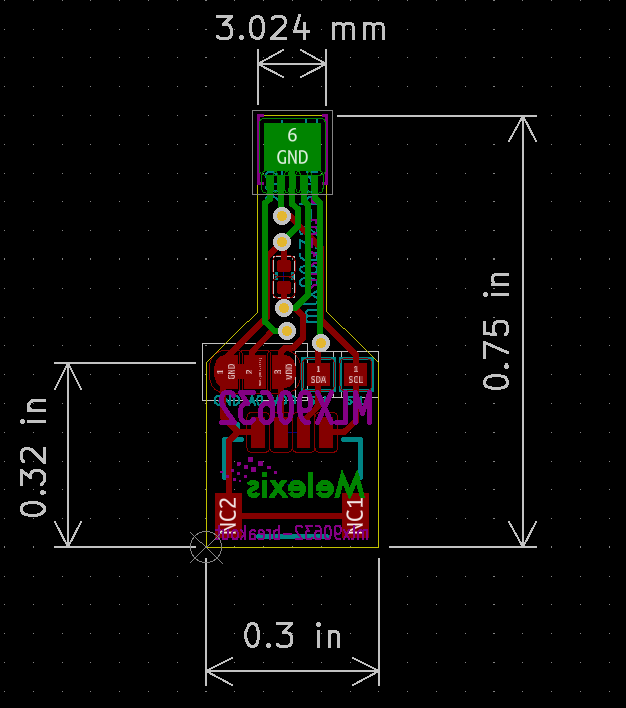
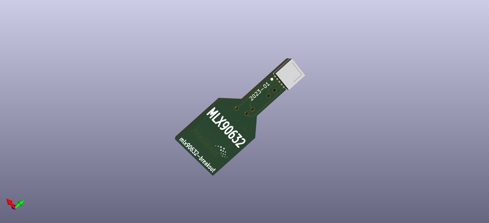
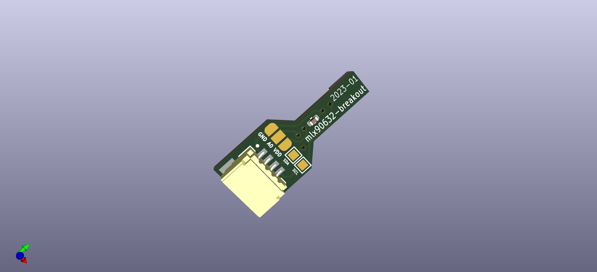

# MLX90632 Breakout

## The sensor

Breakout PBC for MLX90632:  
https://melexis.com/mlx90632

Order codes for the sensor:

### Standard accuracy:  

- MLX90632SLD-BCB-000-RE: VDD=3.3V & 3.3V I2C levels

### Medical Accuracy:

- MLX90632SLD-DCB-000-RE: VDD=3.3V & 3.3V I2C levels
- MLX90632SLD-DCB-100-RE: VDD=3.3V & 1.8V I2C levels

Or contact our sales team at: https://www.melexis.com/en/contact/sales-contact

Where to buy? https://www.melexis.com/en/contact/distributors

## Get started

This board works together with any 3.3V I2C master.  
Have a look at our `I2C STICK` for evaluation pursposes.  
The board uses the QWIIC connector system for I2C & Supply.

QWIIC: https://www.sparkfun.com/qwiic

## The board

### Schema

  

### Layout

  

### 3D View

  
  

### 3D Model

[mlx90632-breakout.step](output/mlx90632-breakout.step)  

### Images

todo

