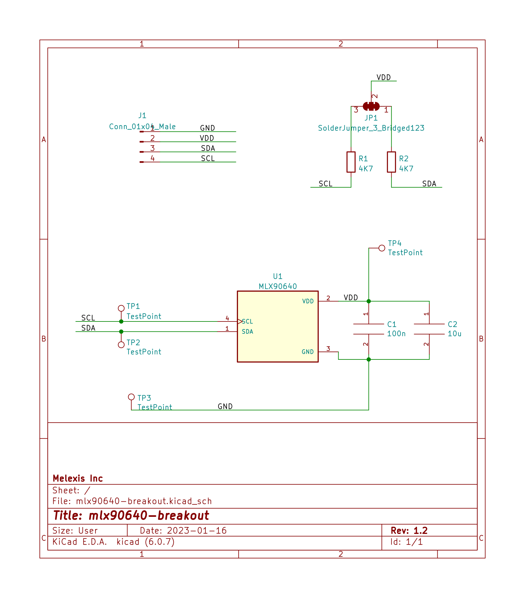
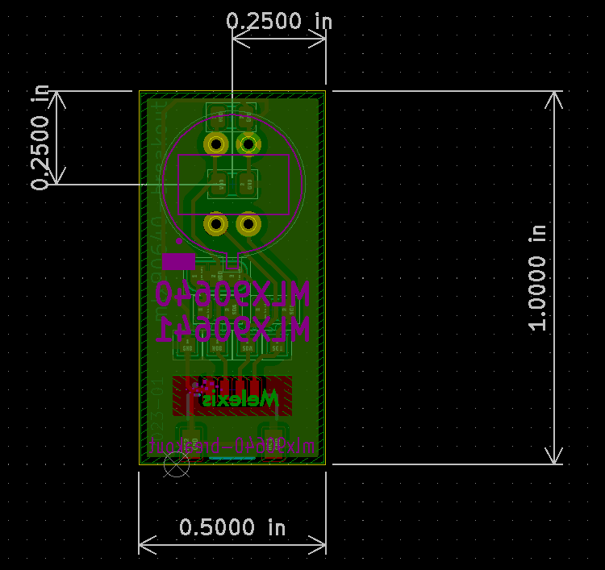
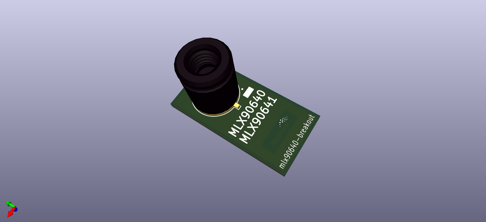
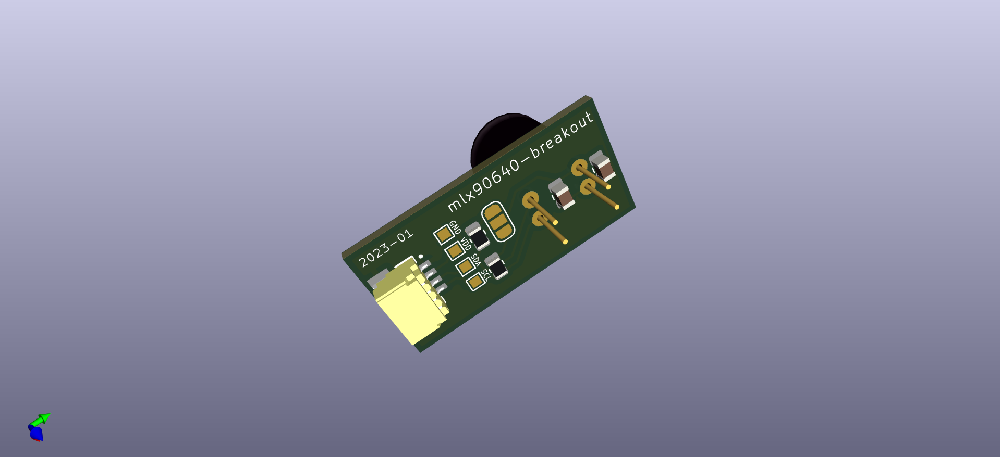
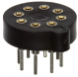

# MLX90640-41 Breakout

## The sensor

Breakout PBC for MLX90640 & MLX90641:  
https://melexis.com/mlx90640  
https://melexis.com/mlx90641

Order codes for the sensor:

### MLX90640:  

32x24 pixel thermal camera

- MLX90640ESF-BAB-000-SP: Small FoV (55x35)
- MLX90640ESF-BAA-000-SP: Wide FoV (110x75)

### MLX90641:

16x12 pixel thermal camera

- MLX90641ESF-BCA-000-SP: Small FoV (55x35)
- MLX90641ESF-BCB-000-SP: Wide FoV (110x75)

Or contact our sales team at: https://www.melexis.com/en/contact/sales-contact

Where to buy? https://www.melexis.com/en/contact/distributors

## Get started

This board works together with any 3.3V I2C master.  
Have a look at our `I2C STICK` for evaluation pursposes.  
The board uses the QWIIC connector system for I2C & Supply.

QWIIC: https://www.sparkfun.com/qwiic

## The board

### Schema

  

### Layout

  

### 3D View

  
  

### 3D Model

[mlx90640-breakout.step](output/mlx90640-breakout.step)  

### Images

todo

### Optional socket:

Mill-Max Manufacturing Corp. - 917-43-208-41-005000  
  
https://www.digikey.com/en/products/detail/mill-max-manufacturing-corp/917-43-208-41-005000/1212173   
Note: 4 pins would have to be cut in order to fit the foot print.
